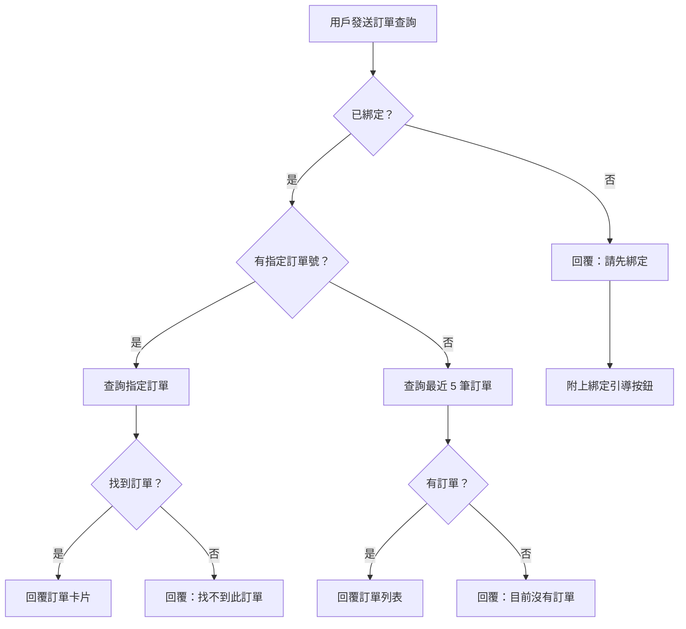

# LINE Bot 會員綁定 + 訂單查詢系統

## 軟體設計規格文件 (SDD)

| 項目 | 內容 |
|------|------|
| 版本 | v1.0 |
| 日期 | 2026-02-07 |
| 作者 | MINJIE STUDIO |
| 狀態 | Draft |

---

## 目錄

1. [系統概述](#1-系統概述)
2. [用戶狀態矩陣](#2-用戶狀態矩陣)
3. [綁定識別優先級](#3-綁定識別優先級)
4. [資料庫 Schema](#4-資料庫-schema)
5. [Edge Function 規格](#5-edge-function-規格)
6. [LINE Flex Message 模板](#6-line-flex-message-模板)
7. [環境變數](#7-環境變數)
8. [LINE Developers 設定步驟](#8-line-developers-設定步驟)
9. [開發順序](#9-開發順序)
10. [安全考量](#10-安全考量)
11. [未來擴展](#11-未來擴展)

---

## 1. 系統概述

### 1.1 目標

建立 LINE Bot 會員綁定 + 訂單查詢系統，實現以下核心功能：

- **會員綁定**：將 LINE 用戶與 Medusa 客戶資料關聯
- **訂單查詢**：讓用戶透過 LINE OA 即時查詢訂單狀態
- **數據基礎**：記錄所有對話，為未來 AI 業務機器人建立訓練數據

### 1.2 技術方案

```
┌─────────────────────────────────────────────────────────────────┐
│                        用戶入口                                  │
├────────────────────────┬────────────────────────────────────────┤
│   網站 LINE Login      │         LINE OA 聊天室                  │
│   (LIFF SDK)          │         (Messaging API)                │
└───────────┬────────────┴───────────────┬────────────────────────┘
            │                            │
            ▼                            ▼
┌─────────────────────────────────────────────────────────────────┐
│              Supabase Edge Function                              │
│              POST /functions/v1/line-webhook                     │
├─────────────────────────────────────────────────────────────────┤
│  • LINE Signature 驗證                                           │
│  • 意圖判斷（關鍵字匹配）                                          │
│  • 會員綁定邏輯                                                   │
│  • 訂單查詢邏輯                                                   │
│  • 對話紀錄存儲                                                   │
└───────────┬─────────────────────────────┬───────────────────────┘
            │                             │
            ▼                             ▼
┌─────────────────────────┐   ┌───────────────────────────────────┐
│   Supabase Database     │   │      Medusa Backend               │
│   • customer_line_      │   │      • customers                  │
│     profiles            │   │      • orders                     │
│   • conversation_logs   │   │      • shipping_address           │
└─────────────────────────┘   └───────────────────────────────────┘
```

### 1.3 兩個用戶入口

| 入口 | 場景 | 取得資料 |
|------|------|----------|
| **網站 LINE Login** | 用戶在網站點擊「LINE 登入」按鈕 | line_user_id, email, display_name, picture_url |
| **LINE OA 綁定** | 用戶加入 LINE OA 後輸入手機號碼綁定 | line_user_id, phone, display_name |

---

## 2. 用戶狀態矩陣

系統需處理 9 種用戶狀態，確保各種情境都能正確處理：

### 2.1 狀態定義表

| 狀態 | 描述 | line_user_id | customer_id | phone | email | 能查訂單 |
|------|------|:------------:|:-----------:|:-----:|:-----:|:--------:|
| **S1** | 純瀏覽網站沒登入 | ❌ | ❌ | ❌ | ❌ | ❌ |
| **S2** | 網站 LINE Login 後沒購買 | ✅ | ✅ | ❌ | ✅ | ❌（無訂單） |
| **S3** | 網站 LINE Login + 購買過 | ✅ | ✅ | ✅ | ✅ | ✅ |
| **S4** | Guest 結帳（沒登入） | ❌ | ❌ | ✅ | ✅ | ❌（無綁定） |
| **S5** | 只加 LINE OA 沒進網站 | ✅ | ❌ | ❌ | ❌ | ❌ |
| **S6** | 加 LINE OA + 在 LINE 裡綁定手機 | ✅ | ❌/✅ | ✅ | ❌ | ✅（用 phone 查） |
| **S7** | S4 的人加了 LINE OA 並綁定（合併） | ✅ | ✅ | ✅ | ✅ | ✅ |
| **S8** | S2 的人在 LINE OA 查訂單 | ✅ | ✅ | ❌ | ✅ | ❌（無訂單） |
| **S9** | 不同 email 在網站買 + LINE 綁另一個 | ✅ | ✅ | ✅ | ✅/⚠️ | ⚠️ 部分 |

### 2.2 狀態轉換圖


### 2.3 關鍵狀態說明

#### S4 → S7（Guest 訂單合併）

這是最重要的轉換場景：

1. 用戶沒登入就結帳（Guest），填寫手機號碼 `0912345678`
2. 訂單儲存在 Medusa，`shipping_address.phone = 0912345678`
3. 用戶後來加入 LINE OA，輸入手機號碼綁定
4. 系統用手機號碼查到歷史訂單
5. 建立 `customer_line_profiles`，關聯 `line_user_id` + `phone`
6. 用戶可以查詢該訂單

#### S9（帳號分裂）

這是需要小心處理的異常情況：

- 用戶在網站用 Email A 結帳
- 在 LINE OA 用 Email B 的手機號碼綁定
- 導致同一個人有兩個不相關的帳號
- **處理策略**：第一版不主動合併，讓用戶能查詢到兩邊的訂單

---

## 3. 綁定識別優先級

### 3.1 識別欄位優先級

```
1. line_user_id（最高優先）
   └── LINE 平台提供，永久唯一不變
   └── 每個 LINE 帳號對應唯一 ID
   └── 格式：U + 32位英數字（如 Uxxxxxxxxxxxxxxxxxxxxxxxxxxxxxxxxx）

2. phone（次高優先）
   └── Guest 結帳必填欄位
   └── LINE OA 綁定時用戶提供
   └── 作為 Guest 訂單和 LINE 帳號之間的橋樑
   └── 格式：09 開頭 10 位數字

3. email（輔助識別）
   └── LINE Login 取得（需用戶授權）
   └── 結帳時填寫
   └── 可能與 phone 分屬不同帳號
```

### 3.2 核心綁定策略

```
┌─────────────────────────────────────────────────────────────────┐
│                     綁定策略核心原則                              │
├─────────────────────────────────────────────────────────────────┤
│                                                                  │
│   手機號碼是 Guest 訂單和 LINE 帳號之間的唯一橋樑                  │
│                                                                  │
│   Guest 結帳 ──[phone]──> 訂單                                   │
│                  │                                               │
│                  ▼                                               │
│   LINE OA ────[phone]───> customer_line_profiles                │
│                  │                                               │
│                  ▼                                               │
│              合併查詢                                             │
│                                                                  │
└─────────────────────────────────────────────────────────────────┘
```

### 3.3 查詢邏輯

```typescript
// 訂單查詢優先級
async function findOrders(lineProfile: CustomerLineProfile): Promise<Order[]> {
  // 1. 優先用 customer_id 查詢（已完整綁定）
  if (lineProfile.customer_id) {
    return await medusa.getOrdersByCustomerId(lineProfile.customer_id);
  }

  // 2. 用 phone 查詢（Guest 訂單）
  if (lineProfile.phone) {
    return await medusa.getOrdersByPhone(lineProfile.phone);
  }

  // 3. 用 email 查詢（備援）
  if (lineProfile.email) {
    return await medusa.getOrdersByEmail(lineProfile.email);
  }

  return [];
}
```

---

## 4. 資料庫 Schema

### 4.1 customer_line_profiles（LINE 綁定表）

儲存 LINE 用戶與 Medusa 客戶的關聯關係。

```sql
CREATE TABLE customer_line_profiles (
  -- 主鍵
  id UUID PRIMARY KEY DEFAULT gen_random_uuid(),

  -- 關聯 Medusa customer（可為 null，純 LINE OA 用戶）
  customer_id UUID,

  -- LINE 用戶資料（核心欄位）
  line_user_id VARCHAR(50) UNIQUE NOT NULL,
  display_name VARCHAR(255),
  picture_url TEXT,

  -- 識別欄位
  phone VARCHAR(20),
  email VARCHAR(255),

  -- 時間戳記
  linked_at TIMESTAMPTZ DEFAULT NOW(),
  last_active_at TIMESTAMPTZ DEFAULT NOW(),

  -- 擴展欄位
  metadata JSONB DEFAULT '{}'::jsonb,

  -- 索引
  CONSTRAINT unique_line_user UNIQUE (line_user_id)
);

-- 索引
CREATE INDEX idx_line_profiles_customer_id ON customer_line_profiles(customer_id);
CREATE INDEX idx_line_profiles_phone ON customer_line_profiles(phone);
CREATE INDEX idx_line_profiles_email ON customer_line_profiles(email);
CREATE INDEX idx_line_profiles_last_active ON customer_line_profiles(last_active_at);
```

#### 欄位說明

| 欄位 | 類型 | 說明 |
|------|------|------|
| `id` | UUID | 主鍵 |
| `customer_id` | UUID | 關聯 Medusa customer.id，可為 null |
| `line_user_id` | VARCHAR(50) | LINE 用戶 ID，唯一必填 |
| `display_name` | VARCHAR(255) | LINE 顯示名稱 |
| `picture_url` | TEXT | LINE 頭像 URL |
| `phone` | VARCHAR(20) | 手機號碼（綁定用） |
| `email` | VARCHAR(255) | Email（LINE Login 取得） |
| `linked_at` | TIMESTAMPTZ | 首次綁定時間 |
| `last_active_at` | TIMESTAMPTZ | 最後活動時間 |
| `metadata` | JSONB | 擴展資料（如綁定來源、標籤等） |

### 4.2 conversation_logs（對話紀錄表）

儲存所有 LINE 對話，作為 AI 訓練數據。

```sql
CREATE TABLE conversation_logs (
  -- 主鍵
  id UUID PRIMARY KEY DEFAULT gen_random_uuid(),

  -- 關聯欄位
  line_user_id VARCHAR(50) NOT NULL,
  customer_id UUID,  -- 可為 null（未綁定用戶）

  -- 訊息內容
  message_type VARCHAR(20) NOT NULL,  -- text/image/sticker/postback
  user_message TEXT,
  bot_response TEXT,

  -- 意圖分析
  intent VARCHAR(50),  -- order_query/binding/product_inquiry/greeting/unknown
  confidence FLOAT,

  -- 上下文資料
  metadata JSONB DEFAULT '{}'::jsonb,

  -- 時間戳記
  created_at TIMESTAMPTZ DEFAULT NOW()
);

-- 索引
CREATE INDEX idx_conv_logs_line_user ON conversation_logs(line_user_id);
CREATE INDEX idx_conv_logs_customer ON conversation_logs(customer_id);
CREATE INDEX idx_conv_logs_intent ON conversation_logs(intent);
CREATE INDEX idx_conv_logs_created ON conversation_logs(created_at);
```

#### message_type 枚舉

| 值 | 說明 |
|------|------|
| `text` | 文字訊息 |
| `image` | 圖片訊息 |
| `sticker` | 貼圖 |
| `postback` | 按鈕回調（Quick Reply / Flex Message 按鈕） |
| `follow` | 加入好友事件 |
| `unfollow` | 封鎖事件 |

#### intent 枚舉

| 值 | 說明 | 觸發關鍵字 |
|------|------|------------|
| `order_query` | 訂單查詢 | 訂單、查、物流、到哪了、#數字 |
| `binding` | 帳號綁定 | 綁定、註冊、手機 |
| `binding_phone` | 輸入手機號碼 | 09開頭10碼 |
| `coupon` | 優惠券查詢 | 優惠、折扣、券 |
| `product_inquiry` | 商品詢問 | 推薦、什麼好、商品 |
| `greeting` | 打招呼 | 你好、嗨、Hi |
| `unknown` | 無法識別 | 其他所有 |

#### metadata 範例

```json
{
  "order_id": "order_01XXXX",
  "display_id": "1234",
  "product_ids": ["prod_01XXXX"],
  "session_id": "sess_xxxxx",
  "source": "line_oa"
}
```

### 4.3 RLS Policy

```sql
-- customer_line_profiles: 僅 service_role 可存取
ALTER TABLE customer_line_profiles ENABLE ROW LEVEL SECURITY;

CREATE POLICY "Service role full access" ON customer_line_profiles
  FOR ALL USING (auth.role() = 'service_role');

-- conversation_logs: 僅 service_role 可存取
ALTER TABLE conversation_logs ENABLE ROW LEVEL SECURITY;

CREATE POLICY "Service role full access" ON conversation_logs
  FOR ALL USING (auth.role() = 'service_role');
```

---

## 5. Edge Function 規格

### 5.1 line-webhook（入口函數）

#### 端點

```
POST https://{project-ref}.supabase.co/functions/v1/line-webhook
```

#### 請求格式

```typescript
// LINE Platform 發送的 Webhook 請求
interface LineWebhookRequest {
  destination: string;
  events: LineEvent[];
}

interface LineEvent {
  type: 'message' | 'follow' | 'unfollow' | 'postback';
  replyToken: string;
  source: {
    type: 'user';
    userId: string;
  };
  timestamp: number;
  message?: {
    type: 'text' | 'image' | 'sticker';
    id: string;
    text?: string;
  };
  postback?: {
    data: string;
  };
}
```

#### 主函數架構

```typescript
import { serve } from 'https://deno.land/std@0.168.0/http/server.ts';
import { createClient } from 'https://esm.sh/@supabase/supabase-js@2';
import { createHmac } from 'https://deno.land/std@0.168.0/crypto/mod.ts';

serve(async (req: Request) => {
  // 1. 驗證 LINE Signature
  const signature = req.headers.get('x-line-signature');
  const body = await req.text();

  if (!verifySignature(body, signature)) {
    return new Response('Invalid signature', { status: 401 });
  }

  // 2. 解析事件
  const { events } = JSON.parse(body);

  // 3. 處理每個事件
  for (const event of events) {
    await handleEvent(event);
  }

  return new Response('OK', { status: 200 });
});

function verifySignature(body: string, signature: string | null): boolean {
  if (!signature) return false;

  const channelSecret = Deno.env.get('LINE_CHANNEL_SECRET')!;
  const hmac = createHmac('sha256', channelSecret);
  hmac.update(body);
  const digest = hmac.digest('base64');

  return digest === signature;
}
```

#### 事件路由

```typescript
async function handleEvent(event: LineEvent): Promise<void> {
  const { type, source, replyToken } = event;
  const lineUserId = source.userId;

  switch (type) {
    case 'follow':
      await handleFollow(lineUserId, replyToken);
      break;

    case 'unfollow':
      await handleUnfollow(lineUserId);
      break;

    case 'message':
      if (event.message?.type === 'text') {
        await handleTextMessage(lineUserId, event.message.text!, replyToken);
      }
      break;

    case 'postback':
      await handlePostback(lineUserId, event.postback!.data, replyToken);
      break;
  }
}
```

### 5.2 意圖判斷邏輯

```typescript
interface IntentResult {
  intent: string;
  confidence: number;
  entities: Record<string, string>;
}

function detectIntent(text: string): IntentResult {
  const normalized = text.trim().toLowerCase();

  // 1. 訂單編號格式（最高優先）
  const orderIdMatch = normalized.match(/#(\d+)/);
  if (orderIdMatch) {
    return {
      intent: 'order_query',
      confidence: 1.0,
      entities: { display_id: orderIdMatch[1] }
    };
  }

  // 2. MerchantTradeNo 格式
  const merchantNoMatch = normalized.match(/([A-Z0-9]{20})/i);
  if (merchantNoMatch) {
    return {
      intent: 'order_query',
      confidence: 0.9,
      entities: { merchant_trade_no: merchantNoMatch[1] }
    };
  }

  // 3. 手機號碼格式
  const phoneMatch = normalized.match(/^09\d{8}$/);
  if (phoneMatch) {
    return {
      intent: 'binding_phone',
      confidence: 1.0,
      entities: { phone: phoneMatch[0] }
    };
  }

  // 4. 關鍵字匹配
  const intentPatterns: Array<{ pattern: RegExp; intent: string; confidence: number }> = [
    { pattern: /訂單|查|物流|到哪|寄到|配送|出貨/, intent: 'order_query', confidence: 0.8 },
    { pattern: /綁定|註冊|會員|手機/, intent: 'binding', confidence: 0.8 },
    { pattern: /優惠|折扣|券|特價|活動/, intent: 'coupon', confidence: 0.8 },
    { pattern: /推薦|什麼好|哪個好|建議/, intent: 'product_inquiry', confidence: 0.7 },
    { pattern: /你好|嗨|hi|hello|哈囉/, intent: 'greeting', confidence: 0.9 },
  ];

  for (const { pattern, intent, confidence } of intentPatterns) {
    if (pattern.test(normalized)) {
      return { intent, confidence, entities: {} };
    }
  }

  // 5. 無法識別
  return {
    intent: 'unknown',
    confidence: 0,
    entities: {}
  };
}
```

### 5.3 綁定流程

#### 流程圖


#### 場景 1：用戶加好友（Follow Event）

```typescript
async function handleFollow(lineUserId: string, replyToken: string): Promise<void> {
  // 1. 取得用戶資料
  const profile = await getLineProfile(lineUserId);

  // 2. 檢查是否已有綁定
  const existingProfile = await supabase
    .from('customer_line_profiles')
    .select('*')
    .eq('line_user_id', lineUserId)
    .single();

  // 3. 如果沒有，建立基本 profile
  if (!existingProfile.data) {
    await supabase
      .from('customer_line_profiles')
      .insert({
        line_user_id: lineUserId,
        display_name: profile.displayName,
        picture_url: profile.pictureUrl,
      });
  }

  // 4. 發送歡迎訊息
  await replyMessage(replyToken, createWelcomeFlexMessage(profile.displayName));

  // 5. 記錄對話
  await logConversation({
    line_user_id: lineUserId,
    message_type: 'follow',
    user_message: '[加入好友]',
    bot_response: '[歡迎訊息]',
    intent: 'follow',
    confidence: 1.0,
  });
}
```

#### 場景 2：手機號碼綁定

```typescript
async function handleBindingPhone(
  lineUserId: string,
  phone: string,
  replyToken: string
): Promise<void> {
  // 1. 格式化手機號碼
  const formattedPhone = phone.replace(/[-\s]/g, '');

  // 2. 查詢 Medusa 訂單 by shipping_address.phone
  const orders = await medusaAdmin.getOrdersByPhone(formattedPhone);

  // 3. 取得或建立 customer
  let customerId: string | null = null;

  if (orders.length > 0) {
    // 從訂單取得 customer_id（如果有）
    customerId = orders[0].customer_id;
  }

  // 4. 更新 customer_line_profiles
  const { error } = await supabase
    .from('customer_line_profiles')
    .upsert({
      line_user_id: lineUserId,
      customer_id: customerId,
      phone: formattedPhone,
      linked_at: new Date().toISOString(),
      last_active_at: new Date().toISOString(),
    }, {
      onConflict: 'line_user_id'
    });

  // 5. 回覆結果
  if (orders.length > 0) {
    await replyMessage(replyToken, createBindingSuccessMessage(orders.length));
  } else {
    await replyMessage(replyToken, createBindingSuccessNoOrderMessage());
  }

  // 6. 記錄對話
  await logConversation({
    line_user_id: lineUserId,
    customer_id: customerId,
    message_type: 'text',
    user_message: phone,
    bot_response: orders.length > 0 ? `綁定成功，找到 ${orders.length} 筆訂單` : '綁定成功，目前沒有訂單',
    intent: 'binding_phone',
    confidence: 1.0,
    metadata: { phone: formattedPhone, orders_found: orders.length }
  });
}
```

#### 場景 3：網站 LINE Login

```typescript
// 此邏輯在 Storefront 端實現，透過 API 呼叫 Edge Function

// storefront/lib/line-login.ts
async function handleLineLoginCallback(liffData: LiffUserData): Promise<void> {
  const { userId, displayName, pictureUrl, email } = liffData;

  // 1. 呼叫 Edge Function 處理綁定
  const response = await fetch('/api/line-login', {
    method: 'POST',
    headers: { 'Content-Type': 'application/json' },
    body: JSON.stringify({
      line_user_id: userId,
      display_name: displayName,
      picture_url: pictureUrl,
      email: email,
    }),
  });

  const { customer_id, session_token } = await response.json();

  // 2. 儲存登入狀態
  localStorage.setItem('customer_id', customer_id);
  localStorage.setItem('session_token', session_token);
}

// Edge Function: line-login-handler
async function handleLineLogin(data: LineLoginData): Promise<CustomerSession> {
  const { line_user_id, display_name, picture_url, email } = data;

  // 1. 查找現有 profile
  let profile = await supabase
    .from('customer_line_profiles')
    .select('*')
    .eq('line_user_id', line_user_id)
    .single();

  if (profile.data) {
    // 已有 profile，更新資料
    await supabase
      .from('customer_line_profiles')
      .update({
        display_name,
        picture_url,
        email,
        last_active_at: new Date().toISOString(),
      })
      .eq('line_user_id', line_user_id);

    return { customer_id: profile.data.customer_id };
  }

  // 2. 查找 Medusa customer by email
  let customer = await medusaAdmin.getCustomerByEmail(email);

  if (!customer) {
    // 建立新 customer
    customer = await medusaAdmin.createCustomer({
      email,
      first_name: display_name,
    });
  }

  // 3. 建立 profile
  await supabase
    .from('customer_line_profiles')
    .insert({
      line_user_id,
      customer_id: customer.id,
      display_name,
      picture_url,
      email,
    });

  // 4. 檢查是否有用 phone 綁定的歷史訂單需要合併
  if (profile?.phone) {
    await mergeGuestOrders(customer.id, profile.phone);
  }

  return { customer_id: customer.id };
}
```

### 5.4 訂單查詢流程

#### 流程圖



#### 查詢邏輯

```typescript
async function handleOrderQuery(
  lineUserId: string,
  entities: Record<string, string>,
  replyToken: string
): Promise<void> {
  // 1. 取得用戶 profile
  const profile = await supabase
    .from('customer_line_profiles')
    .select('*')
    .eq('line_user_id', lineUserId)
    .single();

  if (!profile.data || (!profile.data.customer_id && !profile.data.phone)) {
    // 未綁定
    await replyMessage(replyToken, createBindingPromptMessage());
    return;
  }

  // 2. 查詢訂單
  let orders: Order[];

  if (entities.display_id) {
    // 查詢指定訂單
    orders = await medusaAdmin.getOrdersByDisplayId(entities.display_id);
  } else if (entities.merchant_trade_no) {
    // 用 MerchantTradeNo 查詢
    orders = await medusaAdmin.getOrdersByMerchantTradeNo(entities.merchant_trade_no);
  } else {
    // 查詢用戶所有訂單
    orders = await findOrders(profile.data);
    orders = orders.slice(0, 5); // 最多 5 筆
  }

  // 3. 回覆結果
  if (orders.length === 0) {
    await replyMessage(replyToken, createNoOrderMessage());
  } else if (orders.length === 1) {
    await replyMessage(replyToken, createOrderDetailFlexMessage(orders[0]));
  } else {
    await replyMessage(replyToken, createOrderListFlexMessage(orders));
  }

  // 4. 記錄對話
  await logConversation({
    line_user_id: lineUserId,
    customer_id: profile.data.customer_id,
    message_type: 'text',
    user_message: entities.display_id || entities.merchant_trade_no || '查訂單',
    bot_response: `回覆 ${orders.length} 筆訂單`,
    intent: 'order_query',
    confidence: 1.0,
    metadata: { orders_count: orders.length }
  });
}
```

### 5.5 對話紀錄存儲

```typescript
interface ConversationLog {
  line_user_id: string;
  customer_id?: string;
  message_type: string;
  user_message: string;
  bot_response: string;
  intent: string;
  confidence: number;
  metadata?: Record<string, any>;
}

async function logConversation(log: ConversationLog): Promise<void> {
  await supabase
    .from('conversation_logs')
    .insert({
      ...log,
      created_at: new Date().toISOString(),
    });
}
```

---

## 6. LINE Flex Message 模板

### 6.1 歡迎訊息

```json
{
  "type": "flex",
  "altText": "歡迎加入 MINJIE STUDIO！",
  "contents": {
    "type": "bubble",
    "hero": {
      "type": "image",
      "url": "https://shop.minjie0326.com/images/line-welcome.jpg",
      "size": "full",
      "aspectRatio": "20:13",
      "aspectMode": "cover"
    },
    "body": {
      "type": "box",
      "layout": "vertical",
      "contents": [
        {
          "type": "text",
          "text": "歡迎加入 MINJIE STUDIO！",
          "weight": "bold",
          "size": "xl",
          "color": "#D4AF37"
        },
        {
          "type": "text",
          "text": "Hi {{displayName}}！感謝您加入我們的官方帳號。",
          "size": "sm",
          "color": "#999999",
          "margin": "md",
          "wrap": true
        },
        {
          "type": "text",
          "text": "綁定帳號後即可查詢訂單、獲得專屬優惠！",
          "size": "sm",
          "color": "#999999",
          "wrap": true
        }
      ]
    },
    "footer": {
      "type": "box",
      "layout": "vertical",
      "spacing": "sm",
      "contents": [
        {
          "type": "button",
          "style": "primary",
          "color": "#D4AF37",
          "action": {
            "type": "postback",
            "label": "綁定帳號",
            "data": "action=binding"
          }
        },
        {
          "type": "button",
          "style": "secondary",
          "action": {
            "type": "postback",
            "label": "查詢訂單",
            "data": "action=order_query"
          }
        },
        {
          "type": "button",
          "style": "link",
          "action": {
            "type": "uri",
            "label": "前往官網",
            "uri": "https://shop.minjie0326.com"
          }
        }
      ]
    }
  }
}
```

### 6.2 訂單卡片

```json
{
  "type": "flex",
  "altText": "訂單 #{{display_id}} 詳情",
  "contents": {
    "type": "bubble",
    "body": {
      "type": "box",
      "layout": "vertical",
      "contents": [
        {
          "type": "text",
          "text": "訂單 #{{display_id}}",
          "weight": "bold",
          "size": "xl",
          "color": "#D4AF37"
        },
        {
          "type": "separator",
          "margin": "md"
        },
        {
          "type": "box",
          "layout": "vertical",
          "margin": "md",
          "spacing": "sm",
          "contents": [
            {
              "type": "box",
              "layout": "horizontal",
              "contents": [
                {
                  "type": "text",
                  "text": "狀態",
                  "size": "sm",
                  "color": "#999999",
                  "flex": 1
                },
                {
                  "type": "text",
                  "text": "{{status}}",
                  "size": "sm",
                  "color": "#D4AF37",
                  "flex": 2,
                  "align": "end"
                }
              ]
            },
            {
              "type": "box",
              "layout": "horizontal",
              "contents": [
                {
                  "type": "text",
                  "text": "金額",
                  "size": "sm",
                  "color": "#999999",
                  "flex": 1
                },
                {
                  "type": "text",
                  "text": "NT$ {{total}}",
                  "size": "sm",
                  "color": "#FFFFFF",
                  "flex": 2,
                  "align": "end",
                  "weight": "bold"
                }
              ]
            },
            {
              "type": "box",
              "layout": "horizontal",
              "contents": [
                {
                  "type": "text",
                  "text": "物流",
                  "size": "sm",
                  "color": "#999999",
                  "flex": 1
                },
                {
                  "type": "text",
                  "text": "{{shipping_status}}",
                  "size": "sm",
                  "color": "#FFFFFF",
                  "flex": 2,
                  "align": "end"
                }
              ]
            }
          ]
        },
        {
          "type": "separator",
          "margin": "md"
        },
        {
          "type": "text",
          "text": "商品明細",
          "size": "sm",
          "color": "#999999",
          "margin": "md"
        },
        {
          "type": "box",
          "layout": "vertical",
          "margin": "sm",
          "contents": "{{items}}"
        }
      ]
    },
    "footer": {
      "type": "box",
      "layout": "horizontal",
      "spacing": "sm",
      "contents": [
        {
          "type": "button",
          "style": "primary",
          "color": "#D4AF37",
          "action": {
            "type": "uri",
            "label": "查看詳情",
            "uri": "https://shop.minjie0326.com/orders/{{id}}"
          }
        }
      ]
    },
    "styles": {
      "body": {
        "backgroundColor": "#1a1a1a"
      },
      "footer": {
        "backgroundColor": "#1a1a1a"
      }
    }
  }
}
```

### 6.3 訂單列表（最近 5 筆）

```json
{
  "type": "flex",
  "altText": "您的最近訂單",
  "contents": {
    "type": "carousel",
    "contents": [
      {
        "type": "bubble",
        "size": "micro",
        "body": {
          "type": "box",
          "layout": "vertical",
          "contents": [
            {
              "type": "text",
              "text": "#{{display_id}}",
              "weight": "bold",
              "size": "sm",
              "color": "#D4AF37"
            },
            {
              "type": "text",
              "text": "{{date}}",
              "size": "xs",
              "color": "#999999"
            },
            {
              "type": "text",
              "text": "NT$ {{total}}",
              "size": "md",
              "weight": "bold",
              "margin": "md"
            },
            {
              "type": "text",
              "text": "{{status}}",
              "size": "xs",
              "color": "#D4AF37",
              "margin": "sm"
            }
          ],
          "action": {
            "type": "postback",
            "data": "action=order_detail&id={{id}}"
          }
        },
        "styles": {
          "body": {
            "backgroundColor": "#1a1a1a"
          }
        }
      }
    ]
  }
}
```

### 6.4 綁定成功訊息

```json
{
  "type": "flex",
  "altText": "綁定成功！",
  "contents": {
    "type": "bubble",
    "body": {
      "type": "box",
      "layout": "vertical",
      "contents": [
        {
          "type": "text",
          "text": "✓ 綁定成功！",
          "weight": "bold",
          "size": "xl",
          "color": "#00C851"
        },
        {
          "type": "text",
          "text": "已找到 {{count}} 筆歷史訂單",
          "size": "sm",
          "color": "#999999",
          "margin": "md"
        },
        {
          "type": "text",
          "text": "現在可以直接在這裡查詢訂單狀態囉！",
          "size": "sm",
          "color": "#999999",
          "wrap": true
        }
      ]
    },
    "footer": {
      "type": "box",
      "layout": "vertical",
      "contents": [
        {
          "type": "button",
          "style": "primary",
          "color": "#D4AF37",
          "action": {
            "type": "postback",
            "label": "查看我的訂單",
            "data": "action=order_query"
          }
        }
      ]
    },
    "styles": {
      "body": {
        "backgroundColor": "#1a1a1a"
      },
      "footer": {
        "backgroundColor": "#1a1a1a"
      }
    }
  }
}
```

### 6.5 綁定引導訊息

```json
{
  "type": "flex",
  "altText": "請先綁定帳號",
  "contents": {
    "type": "bubble",
    "body": {
      "type": "box",
      "layout": "vertical",
      "contents": [
        {
          "type": "text",
          "text": "請先綁定帳號",
          "weight": "bold",
          "size": "lg",
          "color": "#FFFFFF"
        },
        {
          "type": "text",
          "text": "綁定後即可查詢訂單、獲得專屬優惠！",
          "size": "sm",
          "color": "#999999",
          "margin": "md",
          "wrap": true
        }
      ]
    },
    "footer": {
      "type": "box",
      "layout": "vertical",
      "contents": [
        {
          "type": "button",
          "style": "primary",
          "color": "#D4AF37",
          "action": {
            "type": "postback",
            "label": "立即綁定",
            "data": "action=binding"
          }
        }
      ]
    },
    "styles": {
      "body": {
        "backgroundColor": "#1a1a1a"
      },
      "footer": {
        "backgroundColor": "#1a1a1a"
      }
    }
  }
}
```

---

## 7. 環境變數

### 7.1 必要環境變數

| 變數名稱 | 說明 | 範例 |
|----------|------|------|
| `LINE_CHANNEL_SECRET` | LINE Messaging API Channel Secret | `xxxxxxxxxxxxxxxxxxxxxxxxxxxxxxxx` |
| `LINE_CHANNEL_ACCESS_TOKEN` | LINE Messaging API Access Token | `xxxxxxx...` (長字串) |
| `MEDUSA_BACKEND_URL` | Medusa 後端 URL | `https://medusa-store-minjie-production.up.railway.app` |
| `MEDUSA_ADMIN_EMAIL` | Medusa Admin 登入帳號 | `admin@minjie.com` |
| `MEDUSA_ADMIN_PASSWORD` | Medusa Admin 登入密碼 | `Admin@123456!` |
| `SUPABASE_URL` | Supabase 專案 URL | `https://xxxx.supabase.co` |
| `SUPABASE_SERVICE_ROLE_KEY` | Supabase Service Role Key | `eyJxxxx...` |

### 7.2 設定方式

```bash
# Supabase CLI 設定 Edge Function 環境變數
supabase secrets set LINE_CHANNEL_SECRET=xxxxxxxx
supabase secrets set LINE_CHANNEL_ACCESS_TOKEN=xxxxxxxx
supabase secrets set MEDUSA_BACKEND_URL=https://medusa-store-minjie-production.up.railway.app
supabase secrets set MEDUSA_ADMIN_EMAIL=admin@minjie.com
supabase secrets set MEDUSA_ADMIN_PASSWORD=Admin@123456!
```

### 7.3 本地開發

建立 `.env.local` 檔案（不要 commit）：

```env
LINE_CHANNEL_SECRET=xxxxxxxx
LINE_CHANNEL_ACCESS_TOKEN=xxxxxxxx
MEDUSA_BACKEND_URL=https://medusa-store-minjie-production.up.railway.app
MEDUSA_ADMIN_EMAIL=admin@minjie.com
MEDUSA_ADMIN_PASSWORD=Admin@123456!
SUPABASE_URL=https://xxxx.supabase.co
SUPABASE_SERVICE_ROLE_KEY=eyJxxxx...
```

---

## 8. LINE Developers 設定步驟

### 8.1 前置作業

1. 登入 [LINE Developers Console](https://developers.line.biz/console/)
2. 選擇或建立 Provider
3. 選擇或建立 Messaging API Channel

### 8.2 Webhook 設定

1. 進入 Channel 的 **Messaging API** 頁籤
2. 找到 **Webhook settings** 區塊
3. 設定以下項目：

| 設定項目 | 值 |
|----------|-----|
| **Webhook URL** | `https://{project-ref}.supabase.co/functions/v1/line-webhook` |
| **Use webhook** | ✅ 啟用 |
| **Webhook redelivery** | 視需求（建議關閉避免重複處理） |

4. 點擊 **Verify** 測試連接

### 8.3 回應設定

1. 找到 **LINE Official Account features** 區塊
2. 點擊 **Edit** 進入 LINE Official Account Manager
3. 設定以下項目：

| 設定項目 | 值 | 說明 |
|----------|-----|------|
| **Greeting message** | ❌ 停用 | 改由 follow event 處理 |
| **Auto-reply message** | ❌ 停用 | 改由 Edge Function 處理 |
| **Webhook** | ✅ 啟用 | 確認與上方設定一致 |

### 8.4 取得憑證

1. 回到 LINE Developers Console
2. 在 **Basic settings** 頁籤取得：
   - **Channel secret** → `LINE_CHANNEL_SECRET`
3. 在 **Messaging API** 頁籤取得：
   - **Channel access token** → `LINE_CHANNEL_ACCESS_TOKEN`
   - 如果沒有，點擊 **Issue** 產生

### 8.5 LIFF 設定（網站 LINE Login 用）

1. 在同一個 Channel 下新增 **LIFF**
2. 設定以下項目：

| 設定項目 | 值 |
|----------|-----|
| **LIFF app name** | MINJIE STUDIO Login |
| **Size** | Full |
| **Endpoint URL** | `https://shop.minjie0326.com/auth/line/callback` |
| **Scope** | ✅ profile, ✅ openid, ✅ email |
| **Bot link feature** | Aggressive |

3. 取得 **LIFF ID** 供前端使用

---

## 9. 開發順序

### Phase 1：基礎建設（Day 1-2）

#### Day 1

| 任務 | 說明 | 驗收標準 |
|------|------|----------|
| 建立資料表 | `customer_line_profiles` + `conversation_logs` | 資料表建立成功，可 CRUD |
| 建立 Edge Function 骨架 | `line-webhook` 基本結構 | 可部署，回傳 200 |
| LINE Signature 驗證 | 實作 HMAC-SHA256 驗證 | 偽造請求回傳 401 |

#### Day 2

| 任務 | 說明 | 驗收標準 |
|------|------|----------|
| LINE Developers 設定 | Webhook URL、停用自動回覆 | Verify 成功 |
| Echo 測試 | 收到訊息回覆相同內容 | 手機測試成功 |
| 對話紀錄存儲 | 所有訊息存入 `conversation_logs` | 資料庫有紀錄 |

### Phase 2：會員綁定（Day 3）

| 任務 | 說明 | 驗收標準 |
|------|------|----------|
| Follow Event 處理 | 發送歡迎 Flex Message | 加好友後收到歡迎訊息 |
| 意圖判斷實作 | 關鍵字匹配邏輯 | 輸入「綁定」觸發綁定流程 |
| 手機綁定流程 | 輸入手機 → 查訂單 → 建立 profile | 手機綁定成功 |
| Flex Message 模板 | 歡迎、綁定成功、綁定引導 | 訊息顯示正常 |

### Phase 3：訂單查詢（Day 4）

| 任務 | 說明 | 驗收標準 |
|------|------|----------|
| Medusa Admin API 串接 | 登入取 token、查訂單 | 能查到訂單資料 |
| 訂單查詢（by customer_id） | 已綁定用戶查最近 5 筆 | 正確顯示訂單列表 |
| 訂單查詢（by display_id） | 查指定訂單 | 輸入 #1234 查到對應訂單 |
| 訂單 Flex Message | 訂單卡片、訂單列表 | 訊息顯示正常 |

### Phase 4：網站 LINE Login（Day 5）

| 任務 | 說明 | 驗收標準 |
|------|------|----------|
| LIFF SDK 整合 | 前端加入 LINE Login 按鈕 | 點擊後跳轉 LINE 授權 |
| 登入回調處理 | 取得 line_user_id + email | 登入成功，取得用戶資料 |
| 自動綁定 | 建立 `customer_line_profiles` | 資料庫有紀錄 |
| Guest 訂單合併 | 用 phone 查歷史訂單 | 訂單正確關聯到用戶 |

### 里程碑

```
Day 1-2: Webhook 連通 + Echo 測試通過
Day 3:   會員綁定流程完成
Day 4:   訂單查詢功能完成
Day 5:   網站 LINE Login 完成
```

---

## 10. 安全考量

### 10.1 LINE Signature 驗證

所有 Webhook 請求必須驗證 LINE Signature，防止偽造請求：

```typescript
function verifySignature(body: string, signature: string | null): boolean {
  if (!signature) return false;

  const channelSecret = Deno.env.get('LINE_CHANNEL_SECRET')!;
  const hmac = createHmac('sha256', channelSecret);
  hmac.update(body);
  const digest = hmac.digest('base64');

  // 使用 timing-safe comparison 防止 timing attack
  return timingSafeEqual(
    new TextEncoder().encode(digest),
    new TextEncoder().encode(signature)
  );
}
```

### 10.2 手機號碼綁定驗證

第一版採用簡單確認機制，未來可升級為 OTP 驗證：

#### 第一版（簡單確認）

```typescript
// 用戶輸入手機後，查到訂單即視為驗證通過
if (orders.length > 0) {
  // 驗證邏輯：有此手機的訂單 = 手機是用戶的
  await createBinding(lineUserId, phone);
}
```

#### 未來版本（OTP 驗證）

```typescript
// 1. 用戶輸入手機
// 2. 發送 OTP 簡訊
// 3. 用戶輸入 OTP
// 4. 驗證通過後建立綁定
```

### 10.3 Edge Function 存取控制

Edge Function 只接受來自 LINE Platform 的請求：

```typescript
serve(async (req: Request) => {
  // 1. 檢查 HTTP 方法
  if (req.method !== 'POST') {
    return new Response('Method not allowed', { status: 405 });
  }

  // 2. 檢查 Content-Type
  const contentType = req.headers.get('content-type');
  if (!contentType?.includes('application/json')) {
    return new Response('Invalid content type', { status: 400 });
  }

  // 3. 驗證 LINE Signature（必須）
  const signature = req.headers.get('x-line-signature');
  const body = await req.text();

  if (!verifySignature(body, signature)) {
    return new Response('Invalid signature', { status: 401 });
  }

  // ... 處理邏輯
});
```

### 10.4 RLS Policy

資料庫層級的存取控制：

```sql
-- 僅 service_role 可存取，前端無法直接查詢
ALTER TABLE customer_line_profiles ENABLE ROW LEVEL SECURITY;
ALTER TABLE conversation_logs ENABLE ROW LEVEL SECURITY;

-- 不建立任何 policy = 預設拒絕所有存取
-- Edge Function 使用 service_role key 繞過 RLS
```

### 10.5 敏感資料處理

| 資料類型 | 處理方式 |
|----------|----------|
| 手機號碼 | 儲存完整，用於訂單查詢 |
| Email | 儲存完整，用於帳號關聯 |
| LINE Access Token | 僅存在環境變數，不存入資料庫 |
| 對話內容 | 儲存完整，用於 AI 訓練（需告知用戶） |

---

## 11. 未來擴展

### 11.1 AI 意圖識別

用 Claude API 替代關鍵字匹配，提升意圖判斷準確度：

```typescript
async function detectIntentWithAI(text: string): Promise<IntentResult> {
  const response = await anthropic.messages.create({
    model: 'claude-3-haiku-20240307',
    max_tokens: 100,
    system: `你是一個電商客服意圖分類器。
    可能的意圖：order_query, binding, coupon, product_inquiry, greeting, unknown
    只回傳 JSON 格式：{"intent": "xxx", "confidence": 0.9, "entities": {}}`,
    messages: [{ role: 'user', content: text }],
  });

  return JSON.parse(response.content[0].text);
}
```

### 11.2 對話紀錄 RAG 知識庫

利用 `conversation_logs` 建立商品知識庫：

1. 收集用戶常見問題
2. 標註正確答案
3. 建立 embedding 向量
4. 實作 RAG 查詢回答

### 11.3 多商家支援

支援不同 LINE OA 對應不同商家：

```sql
-- 新增 merchant_code 欄位
ALTER TABLE customer_line_profiles ADD COLUMN merchant_code VARCHAR(20);
ALTER TABLE conversation_logs ADD COLUMN merchant_code VARCHAR(20);

-- 根據 LINE Channel ID 判斷商家
```

### 11.4 推播系統

主動推播訊息給用戶：

| 推播類型 | 觸發條件 | 內容 |
|----------|----------|------|
| 訂單出貨 | 物流狀態更新 | 您的訂單已出貨！ |
| 優惠券到期 | 到期前 3 天 | 您有優惠券即將到期！ |
| 回購提醒 | 上次購買後 30 天 | 是時候補貨囉！ |
| 新品上架 | 新商品上架 | 新品推薦！ |

```typescript
// 推播 API
async function pushMessage(lineUserId: string, message: FlexMessage): Promise<void> {
  await fetch('https://api.line.me/v2/bot/message/push', {
    method: 'POST',
    headers: {
      'Content-Type': 'application/json',
      'Authorization': `Bearer ${LINE_CHANNEL_ACCESS_TOKEN}`,
    },
    body: JSON.stringify({
      to: lineUserId,
      messages: [message],
    }),
  });
}
```

---

## 附錄

### A. 狀態碼對照表

| 訂單狀態（Medusa） | 顯示文字 |
|-------------------|----------|
| `pending` | 待處理 |
| `completed` | 已完成 |
| `canceled` | 已取消 |
| `requires_action` | 需處理 |

| 物流狀態 | 顯示文字 |
|----------|----------|
| `not_shipped` | 備貨中 |
| `shipped` | 已出貨 |
| `delivered` | 已送達 |
| `returned` | 已退貨 |

### B. 錯誤處理

| 錯誤情境 | 回應訊息 |
|----------|----------|
| 找不到訂單 | 找不到此訂單，請確認訂單編號是否正確 |
| 未綁定查訂單 | 請先綁定帳號才能查詢訂單喔！ |
| 手機格式錯誤 | 請輸入正確的手機號碼（例：0912345678） |
| 系統錯誤 | 系統忙碌中，請稍後再試 |

### C. 參考資源

- [LINE Messaging API 文件](https://developers.line.biz/en/docs/messaging-api/)
- [LINE Flex Message Simulator](https://developers.line.biz/flex-simulator/)
- [Supabase Edge Functions 文件](https://supabase.com/docs/guides/functions)
- [Medusa Admin API 文件](https://docs.medusajs.com/api/admin)

---

*文件結束*
